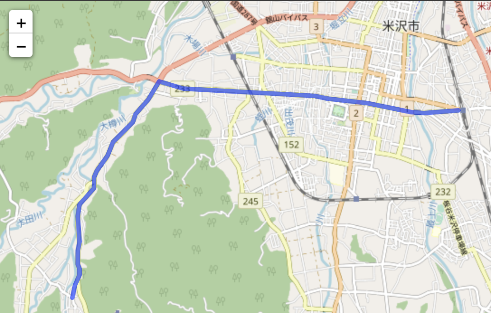

# OSRM server demo
A brief example to combine OSRM with Express (NodeJs) to build your own
production-ready instance.

It is based on [Open Source Routing Machine (OSRM)](https://project-osrm.org)
and [Express](http://expressjs.com/).



## Motivation
There is a nice OSRM server demo repository [here](https://github.com/door2door-io/osrm-express-server-demo), but unfortunately it is not maintained anymore and the code is outdated and doesn't work properly. This repository is intended to provide a new OSRM server demo to replace [osrm-express-server-demo](https://github.com/door2door-io/osrm-express-server-demo).

## Starting the server
Launch the application with the specified dataset.
```
$ docker compose up
```

## API Endpoints

This example application has 3 different endpoints

* `GET /health`: A simple ping endpoint to check that the server is running.

* `POST /api/route`: Implements calls to `osrm.route` to calculate the way from A to B.

  _Example body_:
  ```
    { coordinates: [[140.1781984, 37.9174683], [140.054293, 37.881392]] }
  ```

* `POST /api/match`: Implements calls to `osrm.match` to calculate the most plausible way.

  _Example body_:
  ```
    { coordinates: [[139.892358, 37.500563], [139.892359, 37.500564], [139.89236, 37.500566],] }
  ```

### Curl command example
```
$ curl -X POST -H "Content-Type: application/json" -d '@json/route.json' localhost:5050/api/route
$ curl -X POST -H "Content-Type: application/json" -d '@json/match.json' localhost:5050/api/match
```

### Python example
```
$ cd client
$ python sample.py
```

## Build the docker image
Build the docker image.
```
$ DOCKER_BUILDKIT=1 docker build ./ --build-arg REGION_VERSION=tohoku-latest -t osrm-server-demo
```
Change REGION_VERSION value if you use other regions(kansai-latest kanto-latest... etc).
For more information: http://download.geofabrik.de/
